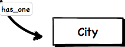

class: center

# Monolith vs. SOA
## Some Middle Ground

--
.v-space[&nbsp;]
.v-space[&nbsp;]
### <i class="fa fa-twitter fa-lg"></i> danisager <i class="fa fa-github fa-lg"></i> dsager

???
- who am i

--
.devex-logo[]

???
- not a perfect solution that always works
- won't solve everybody's problems
- quite common situation in many software projects
- elaborate on our approach to improve


---
# Agenda
## Introduction
## Refactoring Example
## Closing Thoughts

---
layout: true
.header-info[Mono/SOA - Introduction]


---
# .devex-logo[]

--
## Founded 15 years ago
## Several Dev Teams have come and gone
## ~700k registered users
## Content-heavy data

???
- media platform for the international development community
- lots of content: profiles + CVs, news, projects, jobs


---
# Paradigm Shifts

--
## "Micro Services rule!"

--
## "Mono-App FTW!"

--
## "Have to use \_\_\_\_\*, it's awesome!"

--
### \* enter fancy new technology of choice here

???
- not unusual in "grown up" companies
- developers like to play and try new stuff


---
# Our History

--
## Independent Java Applications

--
## Additional Rails Applications

--
## Monolithic Rails Application

--
## Started SOA (node.js + Ruby)

???
- different dev teams over several years
- each step produced some artifacts of technical debt


---
# Recovery

--
## Converging towards Client-Server Model

--
## Back-End wraps DB and other Sources

???
- Grape with AR

--
## Front-End only talks to Back-End

???
- Rails 4
- Custom API-Client

--
## Maintaining Compability with Legacy Applications


---
# Architecture ( simplified )

.center[]


---
layout: true
.header-info[Mono/SOA - Refactoring Example]


---
# Refactoring

--
## An API is perfect for Refactoring!

--
## Refactoring behind the Curtain

--
## Fake desired Interface & Behaviour

--
## Requires well defined Input & Output


---
# Refactoring Example

--
## (Re)Implementing Jobs, which have locations

--
## Locations are handled in a weird Way

--
## We should refactor them, ...

--
## ... but can't really change the Data


---
# Location Tables

.center[]


---
# Locations View

.center[]

--
.center[]

--
.center[]


---
# Problems

--
## Referencing location objects individually

--
## Handling Hierarchies (City -> Country -> Region)

--
## Hard to build a good UX


---
# Possible Solutions

--
## Stick with the old Implementation

???
- require several workarounds 
- won't be awesome

--
## Rewrite and don't re-use anything

???
- free to do what we want
- requires new location data

--
## Maintain Data Structure and rewrite Interface

???
- no new data needed
- makes migration easier


---
# Introducing Places

--
## Wrapping all location-related objects

--
## `ActsAsPlace` and `ActsAsPlaceable`

--
## Places can have Place Children


---
# Example for Placeable

`GET https://devex.com/api/jobs/389754.json`

--
```json
{
  "id": 389754,
  "name": "Senior Front-end Developer",
  "employer_company": {
    "id": 18713,
    "name": "Devex"
  },
  "places": [
    {
      "id": 2470,
      "place_key": "city-2470",
      "name": "Barcelona",
      "type": "City",
      "place_name": "Barcelona, Catalonia, Spain"
    }
  ],
  // ...
}
```


---
layout: true
.header-info[Mono/SOA - Closing Thoughts]


---
# Drawbacks 

--
## Coding Overhead

???
- Overhead decreases over time

--
## Devops Overhead

--
## Increased Dependencies on your API


---
# Benefits

--
## Data Structure is completely hidden

--
## Once you need a public API, it's already there

--
## Browser - API interaction via JS

--
## First step towards SOA...


---
# General Advice

--
## Stick to the standards (REST) as much as possible!

--
## Don't re-invent the wheel!

???
- example: api client

--
## Keep your API clean and structured!

???
- think different solutions through
- example: authentication style per endpoint

--
## Always Look for Refactoring Possibilities!

???
- there are always inconvenient architectures, make the best of it!


---
layout: false
class: center
# Thanks for your Time!

--
.v-space[&nbsp;]

### <i class="fa fa-github fa-lg"></i> dsager.github.io/talks/2015-monolith-vs-soa

--

.devex-logo[]

### jobs.devex.io
